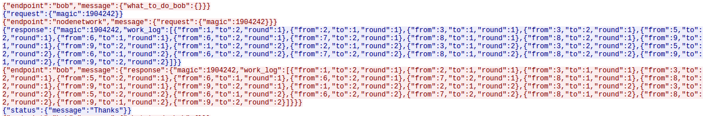
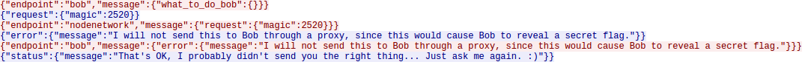

# GoogleCTF18 Finals - BOBNEEDSHELP

I played with 5BC and it was a really enjoyable experience all in all. This challenge is a cute little thing and working on it with other people has been a real pleasure. This is a joined work and I am very grateful to the people who took part in solving it with me.

## The Challenge
This guy bob set up a bunch of nodes to crack some hashes or something but got locked without access to his network. For some unknown reason, by connecting to Bob's router we are able to communicate with both Bob and the network and thus are able to proxy messages back and forth.
We receive a binary which does this proxy work - GoodProxy. It's written in Go and therefore reversing it is a small hell, but from sniffing the traffic we figured it functions roughly as follows:
```python
from pwn import *
import json

r = remote("distributed.ctfcompetition.com" ,1337)

def wtdb():
    return {"message": {"what_to_do_bob": {}}, "endpoint": "bob"}

def send_bob(r, j):
    r.sendline(json.dumps({'message':j, 'endpoint':'bob'}))

def send_net(r, j):
    r.sendline(json.dumps({'message':j, 'endpoint':'nodenetwork'}))

while True:
    r.sendline(json.dumps(wtdb()))
    bresp = json.loads(r.recvline())
    info("request magic {:#032x}".format(bresp['request'['magic']))
    send_net(r, bresp)
    nresp = json.loads(r.recvline())
    send_bob(r, nresp)
    info(r.recvline())
```
In words - we repeatedly drive a process of working on "magics" - we ask bob what to do, bob sends a "magic request" with a specific magic value. We encapsulate this request and send it to the node network. The node network works on the magic and returns us a work log which we pass on to Bob. Bob thanks us and then we start all over again.

Here is a the TCP stream of one iteration:

(Red - messages sent by our binary to the remote router; Blue - messages from the messages received from the router. Note that we specify the addressee of the message with the "endpoint" property of the message.)

This process repeats and repeats but sometimes, Bob asks the magic "2520" but the node network replies with an error saying that it's not willing to process this request over proxy because it will make Bob reveal his flag.


So after pondering a little, the goal of this challenge becomes clear, we need to provide Bob the work log for magic 2520.

## Possible Ideas
There are a few ways it may be possible to achieve that:
1. The binary has some hints or verification about what the "work log" algorithm is, so by reversing it we can find out what's the appropriate log.
2. To provide Bob "work log" that will suffice him and make him reveal the flag.
3. To trick the node network to work on this magic and get the correct "work log".
4. To understand the "work log" logic, synthesize it ourselves and provide it to Bob.

Reversing the binary yielded no results.

We provided Bob a work log of different magic when requested to work on magic 2520, but Bob's response was that the log is incorrect and that it's some kind of security breach.

Tricking the network was an interesting exercise. We tried to send values that differ only in one bit, and we started seeing some patterns. Then someone came up with the idea that the work log function is not bitwise but arithmetic. We started send multiplications of 2520 to the node network and sure enough the node network replied with an error message "I see what you did there". That was a breakthrough!

## The Final Leap
We played with some multiplications of numbers and checked a few properties. First we found out that the order of the work log doesn't matter. We shuffled it in the response to Bob and he accepted it anyway without complaining.
Then we started to send different numbers which are multiplications of each other and found out that if A divides B then the work log for A is a subset of the work log for B.
We started looking for other patterns and characterizations, but then a simpler idea struck our minds: maybe we don't really need to fully understand what the function is doing, after all - CTFing is all about cutting some corners and making educated guesses. We decided to just send a union of the work logs of all the factors of 2520 to Bob and see what happen. To our surprise - **it worked** and Bob gave us the flag.
To this day we have no idea what the function was.

Here is the full script to get the flag:
```python
from pwn import *
import json
import random
import itertools

r = remote("distributed.ctfcompetition.com" ,1337)

def wtdb():
    return {"message": {"what_to_do_bob": {}}, "endpoint": "bob"}

def send_bob(r, j):
    r.sendline(json.dumps({'message':j, 'endpoint':'bob'}))

def send_net(r, j):
    r.sendline(json.dumps({'message':j, 'endpoint':'nodenetwork'}))

def node_req_magic(r, m):
    info("get magic {:d}".format(m))
    send_net(r, {"request": {"magic": m}})
    resp = json.loads(r.recvline())
    if not 'response' in resp:
        return None
    return resp['response']['work_log']

def trip(m):
    a = node_req_magic(r, m)
    if not a:
        return
    for d in a:
        yield d['from'], d['to'], d['round']

def factors(n):
    for i in xrange(1,n/2+1):
        if n % i == 0:
            yield i

s = set()
for d in factors(2520):
    s.update(set(trip(d)))

work = [{'from':a, 'to':b, 'round':c} for (a,b,c) in s]

while True:
    r.sendline(json.dumps(wtdb()))
    bresp = json.loads(r.recvline())
    if bresp['request']['magic'] != 2520:
        info("request magic {:#08x}".format(bresp['request']['magic']))
        send_net(r, bresp)
        send_bob(r, json.loads(r.recvline()))
        r.recvline()
        continue

    context.log_level = "debug"
    info("+" * 82)
    bresp['request']['magic'] = 7
    send_net(r, bresp)
    nresp = json.loads(r.recvline())
    if 'response' in nresp:
        info('replacing')
        nresp['response']['magic'] = 2520
        nresp['response']['work_log'] = work
    send_bob(r, nresp)
    r.recvline()
    break

r.sendline(json.dumps(wtdb()))
r.interactive()
```
